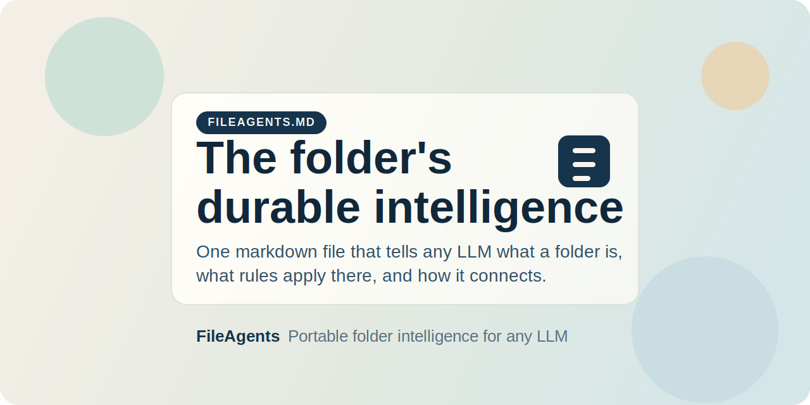

# FileAgents

**The folder is the unit of intelligence. FileAgents turns folders into durable AI operating contexts that compound with use.**



FileAgents is a lightweight open standard built around `FILEAGENTS.md`: a single markdown file that gives a folder durable, portable meaning. It lets any LLM understand what a folder is for, what rules apply there, and how it connects to the rest of your filesystem. `AGENTS.md` is the optional second layer for repeated procedures, but `FILEAGENTS.md` is the core unit. **`humans.html`** is an optional browser-facing summary for people (recommended once a folder is governed).

**Not just markdown conventions:** FileAgents creates a reinforcing loop where each governed folder improves future sessions, each cross-reference increases network value, and each repeated workflow can be captured once and reused indefinitely.

**If you’ve seen “LLM Wiki” / stateful markdown knowledge bases:** FileAgents uses the same **file-over-app, compounding** move, but centers the **`FILEAGENTS.md` constitution per folder** instead of a single global wiki tree. [Mapping table and shared vocabulary →](docs/KARPATHY_LLM_WIKI_BRIDGE.md)

## Why `FILEAGENTS.md` Matters

- One file can permanently explain a folder to any LLM
- Reuses the filesystem you already have instead of creating another app or database
- Works with any model that can read markdown
- Preserves governance and context across sessions and model upgrades
- Survives reorganisation because tags stay stable even when paths change

## Why This Compounds

```
scan -> folders become discoverable
     -> governed folders become legible to AI
     -> tags create cross-folder navigation
     -> repeated work gets captured once
     -> future sessions start smarter
     -> smarter sessions generate better structure
     -> better structure makes the system more valuable
```

This is the key claim: FileAgents is not just a way to document folders. It is a way to turn your filesystem into a compounding AI working memory that improves with use instead of requiring constant re-explanation.

## In One Minute

1. Add the six `system/` files to your LLM context.
2. Ask it to scan a directory.
3. It creates lightweight `FILEAGENTS.md` files only where useful.
4. That file becomes the folder's durable identity and rule layer.
5. Only later, if needed, repeated work gets captured in `AGENTS.md`.

FileAgents turns your existing filesystem into a distributed knowledge graph and durable AI context layer. No database. No app. No vendor. Just `FILEAGENTS.md`, optional `AGENTS.md`, optional `humans.html`, and markdown files that any LLM can read, any human can edit, and any folder can carry forever.

---

## The Problem Nobody Named

Every time you start a new AI session, the model knows nothing about your files. It doesn't know what a folder is *for*, what rules govern it, what quality means there, or how folders relate to each other. So you explain. Every time.

Meanwhile, your filesystem — the largest, oldest, most universal knowledge structure you own — sits there as a dumb hierarchy of names and dates. Decades of organisation logic trapped in your head.

The gap isn't "AI can't read files." The gap is **AI has no idea what your folders mean.**

FileAgents closes that gap permanently.

## The Quoteable Version

`FILEAGENTS.md` gives a folder durable meaning.

`AGENTS.md` gives it reusable procedures.

Together they let the folder remember what the model forgets.

---

## `FILEAGENTS.md` First

If you understand one thing, understand this:

`FILEAGENTS.md` is the product.

It is the durable identity, governance, and context layer for a folder. It is what makes a folder legible to AI without requiring a platform, database, memory layer, or proprietary tool. `AGENTS.md` matters, but it is strictly secondary: execution grows later, only where repeated work justifies it.

## How It Works

Two markdown files per folder (plus optional HTML), one index at the root. That's it.

**FILEAGENTS.md** — the *constitution* and the star of the system. Declares what the folder IS: its purpose, governance rules, quality standards, constraints, tone, and cross-references. Written once, rarely changed. This is the folder's identity.

**AGENTS.md** — the *execution layer*. Declares what an LLM can DO here: procedures, templates, verification checklists, edge cases, domain knowledge. Grows organically through use. Optional. Most folders never need it.

**humans.html** — the *human lens*. A static page you open in a browser (or summon via `/contents [target]`) for a concise, scannable summary aligned with `FILEAGENTS.md` (and `AGENTS.md` at L3). Optional at L1; recommended at L2+. Regenerated when governance or material contents change. See `fileagents.humans.md`.

**fileagents.index.md** — the *discovery cache*. A single auto-generated file at the root that maps every tagged folder. Resolves tags to paths so folders reference each other by stable identifiers, not brittle paths. Disposable — regenerate any time.

### Progressive Elaboration

Not every folder needs intelligence. FileAgents uses a four-level maturity model:

| Level | State | What Exists | How Created |
|-------|-------|-------------|-------------|
| **L0** | Raw | Nothing | Default (~95% of folders) |
| **L1** | Catalogued | FILEAGENTS.md frontmatter only | Automated scan |
| **L2** | Governed | FILEAGENTS.md with body sections; `humans.html` recommended | On request |
| **L3** | Operative | FILEAGENTS.md + AGENTS.md; `humans.html` with procedure summary | Through use |

Most folders stay L0 forever. Some get catalogued. A few get governed. Only the ones you actually work in become operative. **Intelligence concentrates where activity concentrates.** No wasted effort.

---

## The Nine Core Rules

```
1. The folder is the unit of intelligence. The LLM is disposable.
2. Tags are stable identifiers. Never use file paths for cross-references.
3. Never auto-elaborate without human approval.
4. Never overwrite an existing FILEAGENTS.md or AGENTS.md.
5. FILEAGENTS.md is the constitution. AGENTS.md must not contradict it.
6. The index is disposable — regenerate any time.
7. Governance inherits downward. Execution does not.
8. The system works with any LLM. No platform dependencies.
9. **humans.html** is derived from `FILEAGENTS.md` and must not contradict it. It is strictly the human lens—never entangle UI with AI instructions.
10. **Sequential Forcing:** Multi-folder upgrades must halt and verify before sequentially generating HTML nodes to prevent parser crashes.
11. **The Closure Protocol:** Every complex multi-file task must instinctively execute a `/receipt` to output a `.fileagents.receipt.md` logging modified state and constraints.
```

Rule 1 is the philosophical core. Rule 5 is why `FILEAGENTS.md` stays authoritative. Rule 7 is the architectural insight. Rule 11 guarantees self-correction.

---

## Why This Matters: The Multiplier Effects

### 1. `FILEAGENTS.md` Replaces Repeated Explanation (Immediate ROI)

Every LLM session starts cold. Without FileAgents, you burn 20–40% of your context window just getting the model oriented: explaining folder purpose, naming conventions, quality rules, what not to touch.

With FileAgents, the model reads `FILEAGENTS.md` and already knows. One file read replaces hundreds of lines of repeated instruction. The context window is freed for actual work.

**Multiplier: Every governed folder saves context in every future session, across every model, forever.**

### 2. Knowledge Persistence Beyond Sessions (Compound Effect)

LLM sessions are stateless. Your folders are not. FileAgents bridges this gap by encoding operational knowledge into the filesystem itself.

When an L3 folder's AGENTS.md captures "every time I do a gap diagnostic in this folder, here's the procedure" — that knowledge survives model upgrades, platform switches, and session boundaries. The folder remembers what the model forgets.

**Multiplier: Operational knowledge compounds with use. Each session that adds a procedure or edge case to AGENTS.md makes every subsequent session more capable.**

### 3. Network Effects Across Folders (Superlinear Scaling)

A single governed folder is useful. Twenty governed folders with cross-references via tags become a navigable knowledge graph. The index resolves tags to paths, so the model can traverse from a client folder to its legal templates to its pricing models without you pointing the way.

This is Metcalfe's Law applied to your filesystem: the value of the network grows proportionally to the square of connected nodes. Each new governed folder increases the utility of every existing one.

**Multiplier: Value scales as O(n²) with governed folders, not O(n).**

### 4. Structural Survival (Anti-Fragility)

Most knowledge systems break when you reorganise. Move a folder, and every hardcoded path reference dies. FileAgents uses tags as the stable addressing layer. Paths appear only in the disposable index. Move a folder anywhere on disk — its FILEAGENTS.md tags are unchanged. Regenerate the index. Done.

This is the DNS principle applied to filesystems: tags are domain names (stable, human-meaningful), paths are IP addresses (volatile, machine-resolved).

**Multiplier: Reorganisation cost drops to near-zero. You can restructure without fear of breaking cross-references.**

### 5. Governance Inheritance (Efficiency at Scale)

FILEAGENTS.md inherits downward. If a parent folder declares "formal tone, evidence-based, C-suite audience" — every child folder without its own FILEAGENTS.md inherits those rules automatically. You govern the tree, not each leaf.

But AGENTS.md does *not* inherit. Execution procedures are always folder-specific. This prevents a parent's procedures from leaking into contexts where they don't apply.

**Multiplier: One governance decision propagates to N child folders. Execution stays precise.**

### 6. Platform Independence (Option Value)

FileAgents is plain markdown. It works with Claude, GPT, Gemini, Llama, or any model that can read text. No API calls, no proprietary format, no vendor lock-in. Your folder intelligence is an asset you own, not a subscription you rent.

When the next model generation arrives, your folders are already ready for it.

**Multiplier: Investment in folder intelligence carries forward across every platform transition.**

### 7. Human-AI Alignment (Trust Architecture)

The human-gated elaboration model (Rule 3) means the system never writes governance or execution instructions without approval. The activity heatmap surfaces which files cluster together, but waits for you to decide what to do about it.

This creates a trust architecture: the AI suggests, the human approves, the folder remembers. No black-box automation. Full auditability. Every rule in FILEAGENTS.md was human-approved.

**Multiplier: Trust enables delegation. Delegation enables scale. Scale enables leverage.**

### 8. Dead Knowledge Recovery (Hidden Value)

Most organisations have terabytes of files that nobody can navigate without the person who created them. FileAgents' scan operation can catalogue thousands of folders in minutes, creating L1 entries that make previously invisible folders discoverable by tag.

Even L1 — the lightest touch — transforms a folder from "unknown" to "findable." That's the difference between dead storage and living knowledge.

**Multiplier: A single scan surfaces the long tail of your filesystem's latent value.**

---

## The Compounding Architecture

These multiplier effects don't just add — they compound:

```
Scan (L1) → folders become discoverable
         → index creates cross-references
         → cross-references reveal clusters
         → clusters suggest governance (L2)
         → governance enables delegation
         → delegation generates procedures (L3)
         → procedures capture operational knowledge
         → knowledge persists across sessions
         → persistence enables deeper work
         → deeper work generates more knowledge
         → more knowledge → more governed folders
         → more governed folders → richer network
         → richer network → faster discovery
         → faster discovery → ...
```

This is a **reinforcing feedback loop**. The system gets more valuable the more you use it, with near-zero marginal cost per folder. The initial scan is the activation energy. Everything after compounds.

---

## Architecture Decisions Worth Understanding

### Why Tags, Not Paths?

Paths are volatile. You rename a folder, move it to a different drive, restructure your hierarchy — and every hardcoded path breaks. Tags are stable semantic identifiers. They survive any physical reorganisation. The index (disposable, regenerable) handles the tag→path resolution at query time.

This is the same architectural insight behind URNs vs URLs, DNS vs IP addresses, and content-addressable storage vs location-based storage.

### Why `FILEAGENTS.md` + `AGENTS.md` Separation?

`FILEAGENTS.md` (what the folder IS) changes slowly. `AGENTS.md` (what you can DO) changes frequently. Separating them means governance stability doesn't inhibit operational evolution, and operational experimentation can't corrupt governance rules.

This mirrors the separation of policy and mechanism in operating systems, or constitution and legislation in governance.

### Why Not Use HTML for SOPs? (The Two-File Protocol)

A common pitfall is merging AI execution instructions with client-facing HTML documents. This violates the Single Responsibility Principle: modifying the AI prompt breaks the client layout, and styling the layout forces the AI to process thousands of useless CSS tokens (Token Bleed). FileAgents enforcing a strict audience split:
- **`AGENTS.md` (Machine Layer):** Pure, token-efficient markdown mapping explicitly to Hard-Wired Operational Triggers (e.g., `/govern`, `/receipt`) and procedures.
- **`humans.html` (Human Layer):** A visually rich routing page generated from the markdown governance, completely free of raw AI prompting noise.

### SOP Scope & Limitations (The Bounded Pipeline)

FileAgents is deliberately optimized for **linear, functional pipelines** (e.g., *Jotform CSV → Claude SKILL Analysis → Drafted SBR Report*). It is designed to replace "the person reading an email and writing the document." 

**Strengths:**
- Lightning-fast deterministic execution via explicit slash-command triggers.
- Near-zero context bleed due to the strict "folder-as-boundary" rule.
- Exceptional at repetitive document ingestion and highly structured text output.

**Weaknesses & Limitations:**
- **FileAgents is not an autonomous multi-agent swarm.** If your workflow requires cross-repository deep analysis, recursive software debugging, or non-linear lateral problem solving, this structure will break. 
- It forces "Flat-Primitives." It explicitly rejects building complex operating-system hierarchies (`Input/`, `Templates/`, `Process/`) inside functional folders. Maintaining awareness across deep nested hierarchy fractures the LLM's context window. 
- It relies heavily on boundaries. The closure protocol (`/receipt`) mandates that the AI logs its execution friction for human review, rather than attempting recursive, infinite self-correction loops.

If you are trying to build AGI, look elsewhere. If you want to turn a standard filesystem folder into a highly obedient, self-documenting pipeline, use FileAgents.

### Why Human-Gated Elaboration?

Auto-generating governance creates noise. If every folder automatically got L2 governance, you'd have thousands of files making claims nobody verified. The human gate ensures every governed folder reflects actual intent, not inference.

L1 (automated) is cheap and disposable. L2+ (human-approved) is authoritative. The quality gap between these levels is the system's integrity guarantee.

### Why Downward Inheritance for Governance but Not Execution?

A client folder's tone rules ("formal, C-suite") should apply to all its subfolders by default. But a client folder's diagnostic procedure should NOT auto-apply to its archive subfolder. Governance is contextual. Execution is specific. The inheritance model reflects this.

---

## Getting Started

### Prerequisites

Any LLM that can read and write files. No dependencies, no installation, no configuration.

### Quick Start

1. **Point your LLM at the FileAgents system files** — they contain the complete operating instructions
2. **Say "scan this directory"** — the LLM creates L1 `FILEAGENTS.md` files at boundary folders and generates the index
3. **Pick a folder you work in regularly** — say "set up this folder" to turn its `FILEAGENTS.md` into a real governance layer
4. **Work normally** — only as repetition emerges does the LLM suggest capturing procedures in `AGENTS.md`
5. **Get oriented** — type `/contents [folder-tag]` anywhere to seamlessly open the folder's `humans.html` lens in your chat or browser

For a practical walkthrough, see [`QUICKSTART.md`](QUICKSTART.md). For **vault roots, move discipline, staleness, and habits** in production, see [`docs/OPERATIONS.md`](docs/OPERATIONS.md).

**Building a pipeline in one folder?** See **[`docs/MINI_SOP.md`](docs/MINI_SOP.md)** — inputs, templates, outputs, and steps in one place (L3), without assembling the spec from scratch.

### System Files

| File | Purpose |
|------|---------|
| `fileagents.system.md` | Core rules and orchestration logic |
| `fileagents.levels.md` | Level definitions, templates, and field reference |
| `fileagents.scan.md` | Scan algorithm and constraints |
| `fileagents.elaborate.md` | Elaboration procedures (L1→L2→L3) |
| `fileagents.index.md` | Index generation, format, and tag resolution |
| `fileagents.humans.md` | `humans.html` — human-readable folder lens (HTML profile and workflow) |
| `fileagents.sop.md` | Architecture for Native SOP Pipelines and automated workflows |

### Spec Version

Current: **0.3.0**

## Repository Layout

| Path | Purpose |
|------|---------|
| `system/` | The actual FileAgents operating spec |
| `examples/` | Concrete examples of L1, L2, L3, and index output |
| `docs/OPERATIONS.md` | Operating habits: vault root, batch truth, moves, staleness, rituals |
| `docs/KARPATHY_LLM_WIKI_BRIDGE.md` | Mapping / vocabulary bridge for “LLM Wiki” readers |
| `docs/MINI_SOP.md` | One-page recipe: mini-SOP in a single L3 folder (inputs, refs, outputs, steps) |
| `QUICKSTART.md` | Fast onboarding guide |
| `CONTRIBUTING.md` | How to contribute examples, edge cases, and spec improvements |
| `CHANGELOG.md` | Release history |

## Best Fit

FileAgents is most useful if you:

- Work across many folders and repeatedly have to explain them to AI tools
- Want durable local context without vendor lock-in
- Care more about portability and clarity than full automation
- Have a growing archive of projects, clients, research, or reference material

It is less useful if all your work already lives inside a single tightly managed application and not in folders.

---

## What You Can Build Today That Compounds Tomorrow

Run the scan. That's it. A single scan across your working directories creates the discovery layer that every future AI session will benefit from. The 15 minutes you spend today saves context-setting time in every session that follows — across every model, every platform, every tool.

The folders you govern today become the foundation of the knowledge graph you'll navigate tomorrow.

---

## Design Philosophy

FileAgents is built on three convictions:

1. **The filesystem is the most durable, universal, platform-independent knowledge structure in computing.** It will outlast every app, every API, every SaaS platform. Build on it.

2. **Intelligence should live where the work lives.** Not in a separate database. Not in a cloud service. Not in a model's memory. In the folder, next to the files, readable by anything.

3. **Systems that grow with use beat systems that require setup.** L0→L1 is automated. L1→L2 is one conversation. L2→L3 emerges from work. No upfront architecture. No migration. No maintenance burden.

---

## License

MIT

---

*FileAgents was designed by Walter Adamson. The folder is the unit of intelligence. The model is disposable.*
